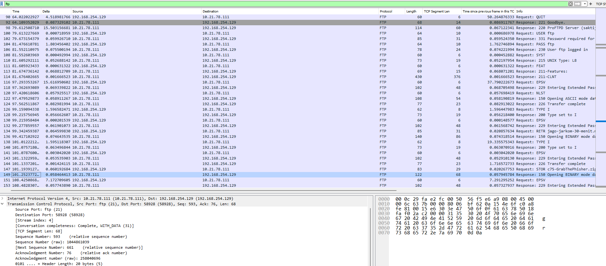

# Jarkom-Modul-1-E19-2023
Laporan Resmi Praktikum Modul 1 Kelompok E19
| Nama               |  NRP       | 
|--------------------|-------------|
| M. Armand Giovanni | 5025211054  |
| Afiq Fawwaz Haidar | 5025211246  |

## Soal 1
**User melakukan berbagai aktivitas dengan menggunakan protokol FTP. Salah satunya adalah mengunggah suatu file.**
- **Sequence number (raw) berapa yang menunjukkan aktivitas ini pada paket?**
- **Acknowledge number (raw) berapa yang menunjukkan aktivitas ini pada paket?**
- **Sequence number (raw) berapa yang menunjukkan respons dari aktivitas ini pada paket?**
- **Acknowledge number (raw) berapa yang menunjukkan respons dari aktivitas ini pada paket?**

Gunakan _expression filter_ `ftp` pada _display filter_ untuk memunculkan paket dengan protokol `FTP`. berikutinya mencari paket data yang menggunakan perintah STOR, yaitu perintah yang digunakan untuk mengunggah suatu file, didapatkan yaitu nomor paket 147. Pada `packet detail pane` , buka _dropdown_ `TCP` atau `Transmission Control Protocol`. Terdapat `Sequence number (raw)` dan `Acknowledge number (raw)` dari paket.

Selanjutnya, kita buka paket yang merupakan `response` dari paket 147. Paket tersebut mengandung `.zip` yang sama dengan paket 147, terletak pada paket 149. Kita ulangi hal yang sama untuk memperoleh `Sequence number (raw)` dan `Acknowledge number (raw)` dari paket.

Flag diperoleh sebagai berikut.

## Soal 2
**Sebutkan web server yang digunakan pada portal praktikum Jaringan Komputer!**

Flag diperoleh sebagai berikut.

## Soal 3
**Dapin sedang belajar analisis jaringan. Bantu Dapin dengan hal berikut:**
- **Berapa banyak paket yang ter-capture dengan IP source atau destination address adalah `239.255.255.250` dan port `3702`?**
- **Protokol lapisan transport apa yang digunakan?**

Flag diperoleh sebagai berikut.

## Soal 4
**Berapa nilai checksum yang didapat dari header pada paket nomor `130`?**

Nilai checksum dapat dilihat pada `packet detail pane` dari protokol `UDP`. Protokol yang digunakan paket 130 adalah `QUIC` sehingga harus dilakukan _decode_ terlebih dahulu sehingga dapat diubah menjadi `UDP` atau `User Datagram Protocol`.

Setelah itu, pada `packet detail pane` dapat dibuka _dropdown_ dari `UDP` sehingga nilai _checksum_ dapat dilihat.

Flag diperoleh sebagai berikut.

## Soal 5
**Elshe menemukan sebuah file packet capture yang menarik. Bantu Elshe untuk menganalisis file packet capture tersebut.**
- **Berapa banyak packet yang berhasil di-capture dari file pcap tersebut?**
- **Port berapa yang digunakan oleh server untuk layanan SMTP?**
- **Dari semua alamat IP yang ter-capture, IP berapakah yang merupakan alamat IP publik?**

Flag diperoleh sebagai berikut.

## Soal 6
**Seorang anak bernama Udin Berteman dengan SlameT yang merupakan seorang penggemar film detektif. Sebagai teman yang baik, ia selalu mengajak SlameT untuk bermain Valorant bersama. Suatu malam, terjadi sebuah hal yang tak terduga. Ketika Udin membuka game tersebut, laptopnya menampilkan sebuah field teks dan sebuah kode Invalid bertuliskan "server SOURCE ADDRESS 7812 is invalid". Ketika ditelusuri di Google, hasil pencarian hanya menampilkan "a1 e5 u21". Jiwa detektif SlameT pun bergejolak. Bantulah Udin dan SlameT untuk menemukan solusi kode error tersebut.**

## Soal 7
**Berapa jumlah packet yang menuju IP `184.87.193.88`?**

Setelah membuka _packet captured_, kita gunakan _filter expression_ `ip.dst == 184.87.193.88` yang merupakan filter paket dengan _destination IP_ `184.87.193.88`. Jumlah paket yang muncul dapat dijumlahkan.

Flag diperoleh sebagai berikut.

## Soal 8
**Berikan kueri filter sehingga Wireshark hanya mengambil semua protokol paket yang menuju port `80`! (Jika terdapat lebih dari 1 port, maka urutkan sesuai dengan abjad).**

Flag diperoleh sebagai berikut.

## Soal 9
**Berikan kueri filter sehingga Wireshark hanya mengambil paket yang berasal dari alamat 10.51.40.1 tetapi tidak menuju ke alamat `10.39.55.34`!**

Setelah membuka _packet captured_, kita gunakan _filter expression_ `ip.src == 10.51.40.1 && ip.dst != 10.39.55.34`.
- `ip.src == 10.51.40.1` merupakan filter paket dengan _source IP_ `10.51.40.1`
- `ip.dst != 10.39.55.34` merupakan filter paket dengan negasi dari _destination IP_ `10.39.55.34`

Kedua _filter expression_ tersebut digabungkan dengan _logical operator_ `&&` atau `AND`

Flag diperoleh sebagai berikut.

## Soal 10
**Sebutkan kredensial yang benar ketika pengguna mencoba login menggunakan Telnet.**

Flag diperoleh sebagai berikut.

